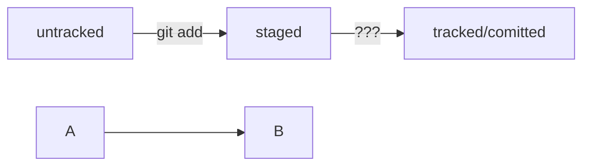

# Основные команды Git

Этот файл содержит список основных команд Git для повседневной работы с репозиториями.

---

## Настройка Git

Настроить имя пользователя  
```
git config --global user.name "Ваше Имя"
```
Настроить email пользователя  
```
git config --global user.email "email@example.com"
```
Проверить настройки  
```
git config --list
```
---

## Инициализация и клонирование репозитория

Инициализировать новый репозиторий  
```
git init
```
Клонировать удалённый репозиторий  
```
git clone <url_репозитория>
```
---

## Работа с изменениями

Проверить статус (изменённые, добавленные, удалённые файлы)  
```
git status
```

Просмотреть отличия в изменениях  
```
git diff
```
---

## Добавление и коммит изменений

Добавить конкретный файл в индекс (staging area)
```
git add <имя_файла>
```
Добавить все изменённые файлы
```
git add .
```
Зафиксировать изменения с сообщением
```
git commit -m "Сообщение коммита"
```
---

## Работа с ветками

Посмотреть все ветки
```
git branch
```
Создать новую ветку
```
git branch <имя_ветки>
```
Переключиться на ветку
```
git checkout <имя_ветки>
```
Создать и сразу переключиться на ветку
```
git checkout -b <имя_ветки>
```
---

## Работа с удалёнными репозиториями
Посмотреть подключённые удалённые репозитории
```
git remote -v
```
Добавить новый удалённый репозиторий
```
git remote add origin <url_репозитория>
```
Отправить изменения на удалённый репозиторий
```
git push origin <ветка>
```
Получить изменения с удалённого репозитория
```
git pull origin <ветка>
```
---

## Просмотр истории

Показать историю коммитов
```
git log
```
Показать краткую историю
```
git log --oneline
```
---

## Отмена изменений

Отменить изменения в файле (возврат к последнему коммиту)
```
git checkout -- <имя_файла>
```
Отменить последний локальный коммит (оставить изменения в рабочей директории)
```
git reset --soft HEAD~1
```
Отменить последний коммит и изменения в индексе
```
git reset --hard HEAD~1
```
---

## Полезные советы

- Используйте `git status` перед каждым коммитом, чтобы понять текущее состояние репозитория.
- Пишите информативные сообщения к коммитам.
- Регулярно пушьте изменения, чтобы не потерять прогресс.

---



## Просмотр информации о коммитах
```
git log (от англ. log, «журнал [записей]») — выведи подробную историю коммитов;
git log --oneline (от англ. log, «журнал [записей]» + one line, «одной строкой») — покажи краткую информацию о коммитах: сокращённый хеш и сообщение.
```

## Просмотр состояния файлов

```
git status (от англ. status, «статус», «состояние») — покажи текущее состояние репозитория.
```

## Добавление изменений в последний коммит
```
git commit --amend --no-edit (от англ. amend, «исправить») — добавь изменения к последнему коммиту и оставь сообщение прежним;
git commit --amend -m "Новое сообщение" — измени сообщение к последнему коммиту на Новое сообщение.
```
## Выйти из редактора Vim: нажать Esc, ввести :qa!, нажать Enter.

## «Откат» файлов и коммитов
```
git restore --staged hello.txt (от англ. restore, «восстановить») — переведи файл hello.txt из состояния staged обратно в untracked или modified;
git restore hello.txt — верни файл hello.txt к последней версии, которая была сохранена через git commit или git add;
git reset --hard b576d89 (от англ. reset, «сброс», «обнуление» + hard, «суровый») — удали все незакоммиченные изменения из staging и «рабочей зоны» вплоть до указанного коммита.
```
## Просмотр изменений
```
git diff (от англ. difference, «отличие», «разница») — покажи изменения в «рабочей зоне», то есть в modified-файлах;
git diff a9928ab 11bada1 — выведи разницу между двумя коммитами;
git diff --staged — покажи изменения, которые добавлены в staged-файлах.
```

*Этот README поможет вам быстро освоить базовые операции с Git и эффективно работать с репозиториями.*
